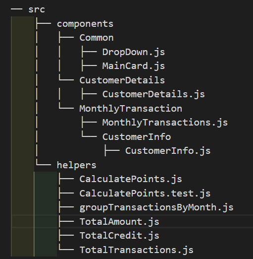
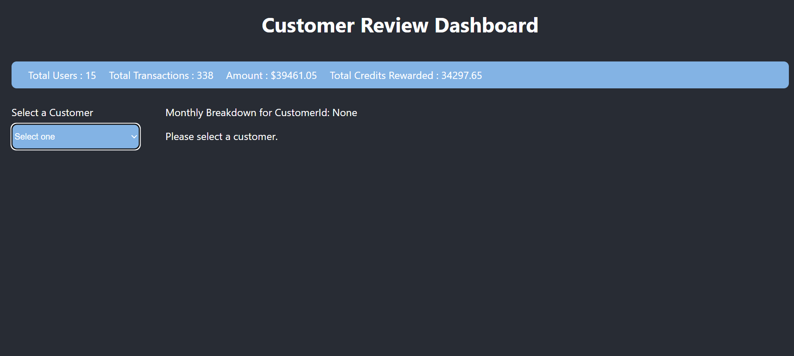
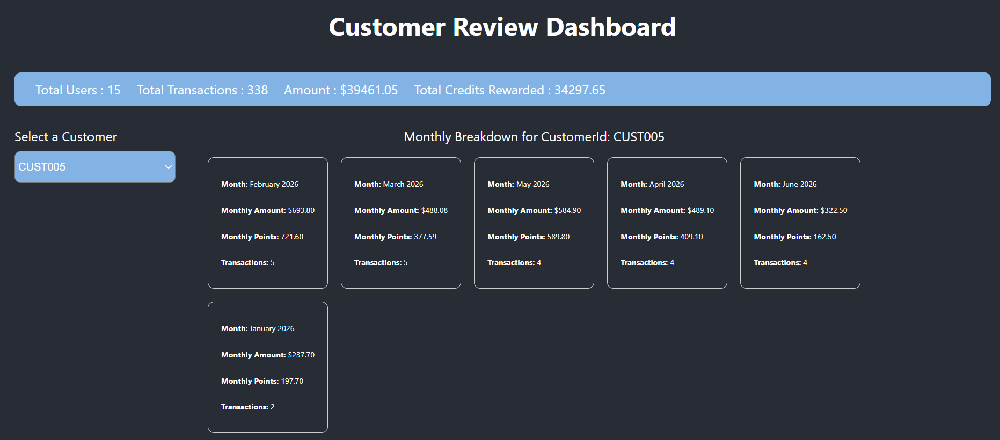
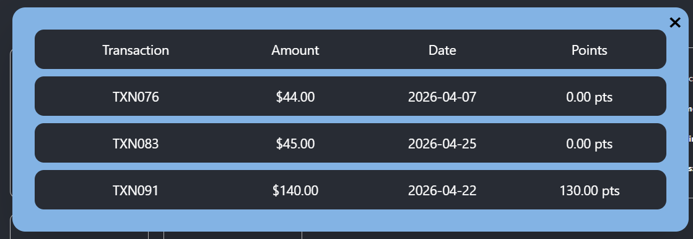
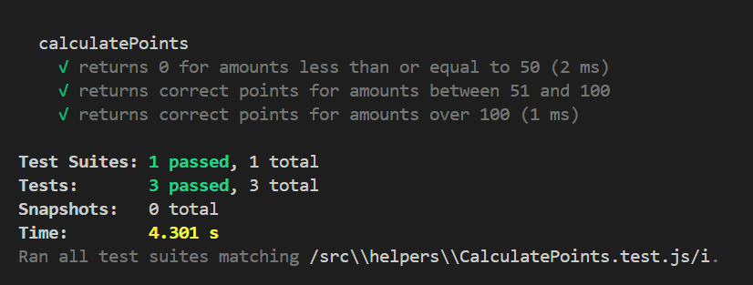

# Customer Review Dashboard

## Overview

Customer Review Dashboard is a React application for analyzing customer transaction data, calculating reward points, and displaying interactive monthly summaries. The app uses JSON data, helper functions, and modular components to deliver a customer-focused transaction dashboard.

## Key Features

- Customer selection dropdown for browsing individual customer data
- Summary cards showing:
  - total users
  - total transactions
  - total amount spent
  - total reward credits
- Monthly aggregation cards for selected customer
- Clickable month cards that open a modal with transaction-level details
- Reward point calculation using business rules:
  - 0 points for amounts `<= 50`
  - 1 point for every dollar between `50` and `100`
  - 2 points for every dollar over `100`

## Data Structure

Transactions are stored in `public/customer_transactions.json` and loaded using `fetch('/customer_transactions.json')` during runtime. Each customer object contains:

- `customerId`
- `customer`
- `transactions`: array of `{ transactionId, amount, date }`

## Folder Structure

## Scripts

- `npm run dev` - start the React development server
- `npm test` - run the test runner

## Application Screen-Shots

## Test-cases

